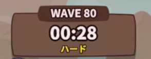
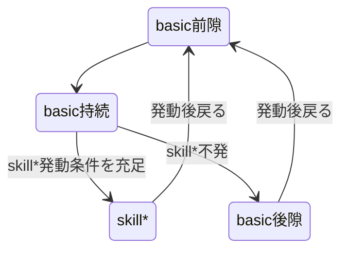
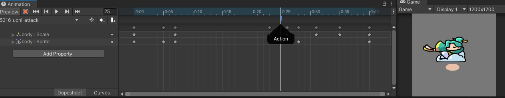

# キャラクターのアニメーションのモーションフレームについて
**本記事は未検証の部分を含みます**
[英語版(English)](./motion_frame_en.md)

## まえおき
### ゲーム内の時間の進み方について
ゲーム内画面上部に存在するタイマーにおける1秒は現実時間では2/3秒である。ゲームは60FPSだがゲーム内時間における1秒は40フレームで構成されている。

またVVIP課金による倍速機能は5/3倍の速度になる。通常速度でゲーム内時間1秒が40フレームだったのが倍速により24フレームになる。本記事では特別な言及がない限り通常速度でのプレイを前提としている。

### 内部の名称
内部的には以下のようになっており、本記事でもそれを採用する。

基本攻撃：`basic`
スキル1, スキル2, 究極：`skill1`, `skill2`, `skill3`

## 各挙動のモーションフレーム
キャラの射程内に敵キャラが存在し、キャラが持続的に攻撃可能な状態のとき状態遷移図は以下のとおりである。

### `basic`のモーションフレーム
$$
A = \text{白字攻撃速度} + \text{緑字攻撃速度}
\qquad
\left( A:\ \text{ゲーム内1秒間にキャラが攻撃する回数} \right) \\
B = \frac{40}{A} = \text{basic前隙} + \text{basic持続} + \text{basic後隙}
\qquad
\left( B:\ \text{basicのモーションフレーム数} \right) \\
$$

各キャラにはbasicダメージが発生する瞬間のモーションが存在する（わかりやすいものだとウチの扇子、インディの甲羅、アイアンニャンのビーム発生フレームのこと）。そのモーションを`basic持続`とし、それより前/後のモーションをそれぞれ`basic前隙`、`basic後隙`としている。現状実装されているすべてのキャラのbasic持続は1Fである。

Animation`{{キャラID}}_{{キャラ表示名}}_attack`それぞれのAnimation Eventに`Action()`が存在し、この25Fが`basic持続`, 0~24Fが`basic前隙`, 26~41Fが`basic後隙`となる。

basic発動時はこのAnimationが攻撃速度に対応したフレーム数($B=A/40$)になるように倍速再生される。例として攻撃速度（=白字攻撃速度+緑字攻撃速度）が3のウチの場合、$B=40/3=13.333\cdots$で`basic前隙`が$(40/3)/42*25 = 7.937\mathrm{F}$, 同様に`basic持続`が0.317F, `basic後隙`が5.079Fとなる。

現状の観測上このゲームではサブフレームを考慮していないと思われるが、どのような丸め込みで実効値が割り出されるかは要検証。

### `skill*`発動時の`basic`のモーションフレーム
`basic`発動時（あるいは発動前に）に`skill*`の発動判定が行われる。発動確率%が指定されているスキルであればその抽選が行われ、マナ/クールタイムによる究極を持つ場合は溜まっているかが判定される。検証はかなり困難だが重複して発動条件を満たした場合は究極が優先されると考えられる。

この判定により`skill*`が発動した場合`basic前隙`と`basic持続`を発動した直後に`basic後隙`をキャンセルし`skill*`のモーションフレームに移行する（未検証だがもしかしたら`basic持続`もキャンセルしているかも）。

なお究極スキルの発動判定タイミングについてマナの場合は他スキルと同様のタイミング（`basic`発動時）に行われ、クールタイムの場合は`basic`発動前に判定される。つまりクールタイムキャラの究極スキルは`basic`を経由する必要がない。

### `skill*`のモーションフレーム
究極、各スキル（`basic`以外）のモーションフレームで、内部上では`{{キャラID}}_{{キャラ表示名}}_skill*`となっている。このモーションフレームは攻撃速度の影響を受けず、倍速機能や特殊なゲームモードを除けば常に一定である。

以下のようにアイアンニャンのスキルロケットパンチ`5204_ironmeow_skill_1`のアニメーションは77Fであり、通常プレイでは2/3倍の実効値52F（51.333が丸め込まれている？）であることが確認できる。

## 実測データを用いた検証
https://www.youtube.com/watch?v=fQHmsbFw1B8

上の3127Fの動画では`basic`を158回、`skill1`を18回、`skill2`を3回発動している。
`basic前隙`+`basic持続`は10F, `basic後隙`は2F, `skill1`は52F, `skill2`は112Fなのでこれらを加算すると3126Fとなる。

$$
\text{全体フレーム} = (\text{basic前隙+basic持続+basic後隙})\times \text{skill発動なしのbasic発動回数}
\\ + (\text{basic前隙+basic持続}) \times \text{skill発動時のbasic発動回数}
\\ + \text{skill1モーションフレーム} \times \text{skill1発動回数}
\\ + \text{skill2モーションフレーム} \times \text{skill2発動回数} \\
\text{全体フレーム} = 12 \times 137
\\ + 10 \times 21
\\ + 52 \times 18
\\ + 112 \times 3 \\
\text{全体フレーム} = 3126
$$

動画内では3127Fなので1Fの誤差があるがこの誤差は録画開始直後と終了直前のラグによるフレーム欠損が原因であると考えられる。
