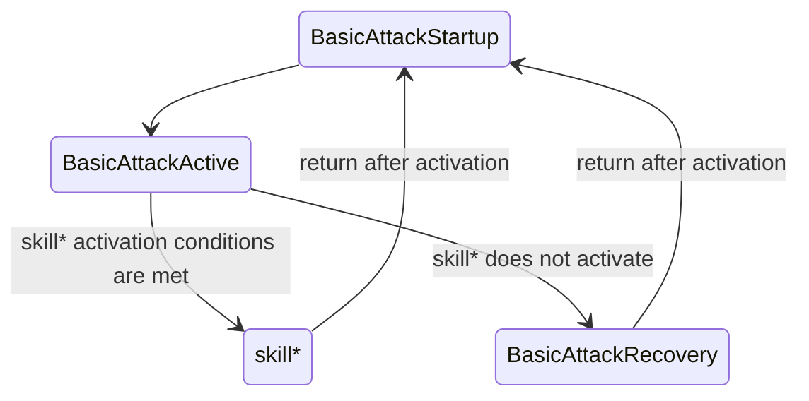
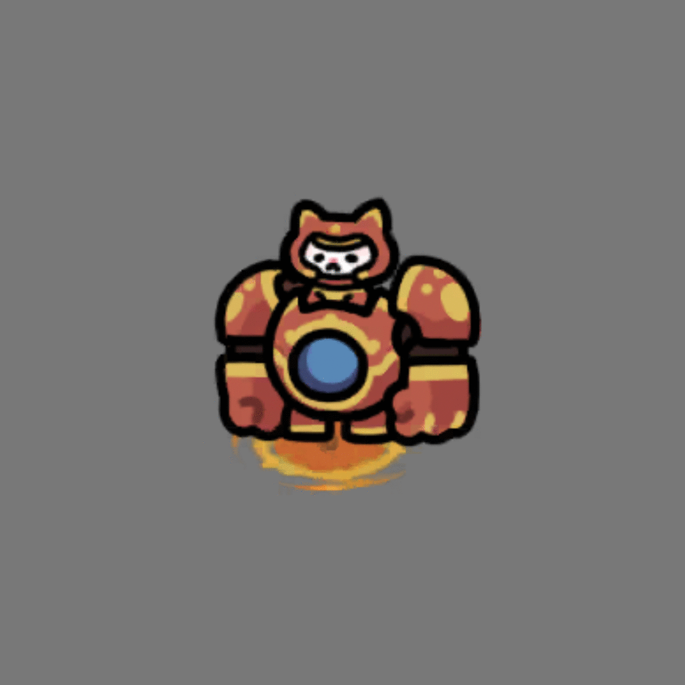

# About Motion Frames in Character Animations
**This article contains unverified sections.**

[Japanese Version](./motion_frame.md)

## Preface
### How time advances in-game
One second on the timer at the top of the in-game screen corresponds to 2/3 of a real-world second. The game runs at 60 FPS, but one second of in-game time consists of 40 frames.

The speed-up feature unlocked by VVIP runs at 5/3x speed. One second of in-game time, which is 40 frames at normal speed, becomes 24 frames under speed-up. Unless otherwise noted, this article assumes play at normal speed.

### Internal names
Internally, the names are as follows, and this article uses the same convention.

`basic`: `BasicAttack`  
`basic前隙`: `BasicAttackStartup`  
`basic持続`: `BasicAttackActive`  
`basic後隙`: `BasicAttackRecovery`  
`skill1`, `skill2`, `skill3`: Skill 1, Skill 2, Ultimate

## Motion frames for each action
When an enemy is within a character's attack range and the character can keep attacking continuously, the state transition diagram is as follows.

### Motion frames of `BasicAttack`
$$
\begin{aligned}
A &= \text{white-text ATK SPD} + \text{green-text ATK SPD}
\qquad \left( A:\ \text{number of attacks per second of in-game time} \right) \\
B &= \frac{40}{A}
   = \text{BasicAttackStartup} + \text{BasicAttackActive} + \text{BasicAttackRecovery}
\qquad \left( B:\ \text{number of motion frames in BasicAttack} \right)
\end{aligned}
$$

Each character has a motion frame at which BasicAttack damage occurs. Easy-to-see examples are tao's fan, Indy's shell, and ironmeow's beam emission frame. This motion is called `BasicAttackActive`, and the motions before and after it are called `BasicAttackStartup` and `BasicAttackRecovery`, respectively. For every character currently implemented, `BasicAttackActive` is 1F.

Each `Animation {{CharacterID}}_{{CharacterDisplayName}}_attack` has an `Animation Event` containing `Action()`. Frame 25 is `BasicAttackActive`, frames 0-24 are `BasicAttackStartup`, and frames 26-41 are `BasicAttackRecovery`.

When BasicAttack is used, this animation is played faster so that its duration matches the frame count determined by attack speed (`B = 40 / A`). For example, if tao has ATK SPD 3 (= white-text ATK SPD + green-text ATK SPD), then `B = 40 / 3 = 13.333...`, so `BasicAttackStartup` is `((40 / 3) / 42) * 25 = 7.937F`, `BasicAttackActive` is `0.317F`, and `BasicAttackRecovery` is `5.079F`.

Based on current observations, this game likely does not use subframes, but it still needs to be verified how the effective values are rounded.

### Motion frames of `BasicAttack` when `skill*` activates
A check for whether `skill*` activates is performed when `BasicAttack` is used, or just before it is used. If the skill has a percentage activation chance, that roll is performed at this point. If the character has an ultimate tied to mana or cooldown, the game checks whether it is ready. This is very difficult to verify thoroughly, but if multiple activation conditions are satisfied at the same time, the ultimate is likely prioritized.

If `skill*` activates as a result of this check, `BasicAttackRecovery` is canceled immediately after `BasicAttackStartup` and `BasicAttackActive`, and the motion transitions to `skill*` (this is unverified, but `BasicAttackActive` itself may also be canceled).

For ultimate activation timing, mana-based ultimates are checked at the same timing as other skills, namely when `BasicAttack` is used. Cooldown-based ultimates are checked before `BasicAttack` is used. In other words, a cooldown-based character's ultimate does not need to go through `BasicAttack`.

### Motion frames of `skill*`
These are the motion frames for the ultimate and for each skill other than `BasicAttack`; internally they are named `{{CharacterID}}_{{CharacterDisplayName}}_skill*`. These motion frames are unaffected by ATK SPD and remain constant except for the speed-up feature and special game modes.

As shown below, the animation for ironmeow's Rocket Punch, `5204_ironmeow_skill_1`, is 77F, which corresponds to an effective 52F in normal play after the 2/3 multiplier is applied (is 51.333 rounded?).

## Validation using measured data
https://www.youtube.com/watch?v=fQHmsbFw1B8

In the 3127F video above, `BasicAttack` activates 158 times, `skill1` activates 18 times, and `skill2` activates 3 times. `BasicAttackStartup` + `BasicAttackActive` is 10F, `BasicAttackRecovery` is 2F, `skill1` is 52F, and `skill2` is 112F, so the total becomes 3126F.

$$
\begin{aligned}
\text{Total frames}
&= (\text{BasicAttackStartup}+\text{BasicAttackActive}+\text{BasicAttackRecovery}) \times \text{number of BasicAttack activations without skill activation} \\
&\quad + (\text{BasicAttackStartup}+\text{BasicAttackActive}) \times \text{number of BasicAttack activations with skill activation} \\
&\quad + \text{skill1 motion frames} \times \text{skill1 activations} \\
&\quad + \text{skill2 motion frames} \times \text{skill2 activations} \\
\\
\text{Total frames}
&= 12 \times 137 \\
&\quad + 10 \times 21 \\
&\quad + 52 \times 18 \\
&\quad + 112 \times 3 \\
\\
\text{Total frames}
&= 3126
\end{aligned}
$$

The video shows 3127F, so there is a 1F discrepancy. This is likely caused by frame loss from lag immediately after recording starts and just before it ends.
